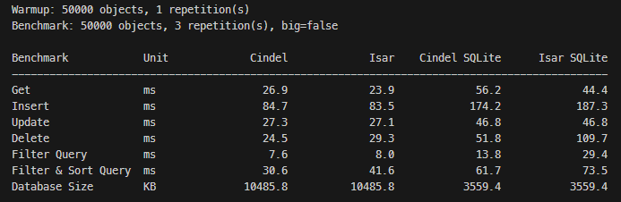
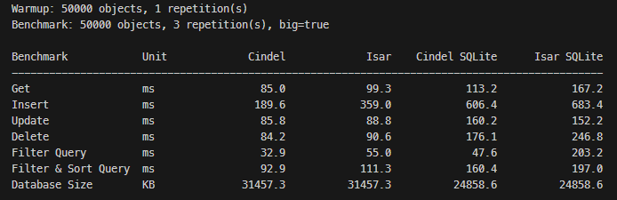

# Cindel

This repository is the Cindel monorepo. The public package documentation lives
in the package README:

[Read the Cindel package guide](packages/cindel/README.md)

## Packages

- `packages/cindel`: public Dart API, FFI bridge, and Rust native core.
- `packages/cindel_annotations`: collection, index, enum, and schema
  annotations shared by the public API and generator.
- `packages/cindel_generator`: generated schemas, serializers, query builders,
  and typed collection helpers.
- `packages/cindel_flutter_libs`: prebuilt native libraries for Flutter apps.
- `examples/cindel_shop_lite`: example Flutter shop application.

## Development

Cindel is still pre-1.0 and the monorepo root is a development workspace, not a
published package. Package-level installation, usage, and platform notes are in
the Cindel package README.

Useful project files:

- [packages/cindel/README.md](packages/cindel/README.md)
- [CHANGELOG.md](CHANGELOG.md)
- [CONTRIBUTING.md](CONTRIBUTING.md)
- [ROADMAP.md](ROADMAP.md)

## Benchmarks

Benchmarks are a rough signal rather than an absolute performance guarantee,
but they are useful for tracking whether changes move Cindel in the right
direction. The charts below compare the current app-style benchmark in both
small and larger payload modes.

### Small Payloads

`big=false`

### Larger Payloads

`big=true`

If you want to inspect more benchmark cases or check how Cindel performs on
your device, you can run the
[benchmarks](https://github.com/mainser/cindel_benchmark) yourself.

## License

Cindel is licensed under the Apache License, Version 2.0. See [LICENSE](LICENSE).
